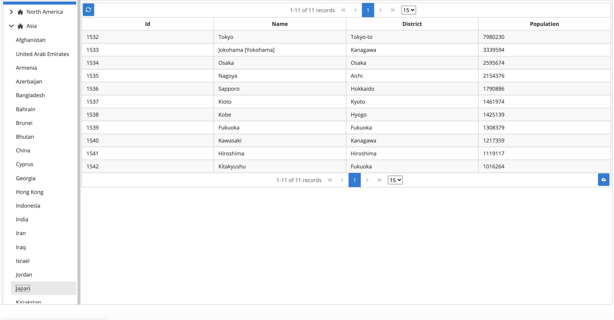

# Deploy Java Web App to Tomcat9 on Azure App Service on Linux 


## Overview of this Application

This Java Web Application is not Microservices Application but standard Java Web Application which is wrote by using Java EE 8 technologies.  

At first, you can select and expand the Continent (North America, Asia, Africa, Europe, South America, Oceania, Antarctica) in the left side of the menu, then you can see the countries in the Continent. Then you can select the one country, then you can see the cities where has the number of the population over 1,000,000 in right side of the screen like follows.  
All of the data is converting from Managed [Azure Database for MySQL](https://docs.microsoft.com/azure/mysql/?WT.mc_id=docs-github-yoterada).





## Runtime selection of Azure App Service on Linux for Java

In order to confirm which Java Runtime we can use on [Azure App Service on Linux](https://docs.microsoft.com/azure/app-service/containers/app-service-linux-intro?WT.mc_id=docs-github-yoterada), you can execute the following command.  

`az webapp list-runtimes --linux`

```azurecli
az webapp list-runtimes --linux 
  "TOMCAT|8.5-jre8",
  "TOMCAT|9.0-jre8",
  "JAVA|8-jre8",
  "WILDFLY|14-jre8",
  "TOMCAT|8.5-java11",
  "TOMCAT|9.0-java11",
  "JAVA|11-java11",
```

For example, if you select the `JAVA`, you can deploy and run the Executable JAR file like Spring Boot or MicroProfile and it will run on Docker Container. And if you select the `TOMCAT` or `WILDFLY`, you can deploy and run the `***.war` file and it will run on Linux. You can also select the Java Runtime between Java 8 or Java 11.  

In this application, we will use the `TOMACT 9.0` and `Java11`.


## More Detail Runtime Environment

This appication will run on Tomcat 9 with JDK 11. In this application, I used following technologies.

* JDK 11
* Servlet (4.0.1)
* JavaServer Faces (2.4)
* PrimeFaces (8.0)
* JSP Standard Tag Library-JSTL (1.2)
* Weld-CDI (2.4.8.Final)
* SQL Server JDBC Driver (12.6.1.jre11)
* Java Persistence API-JPA (2.2)
* EcliseLink (2.7.7)
* Bean Validation (1.1.0.Final)
* Jakarta JSON-B (1.0.2)

On Azure Web App Tomcat on Linux environment, following JDK (Zulu OpenJDK) is installed.  

```bash
# java -version
openjdk version "11.0.3" 2019-04-16 LTS
OpenJDK Runtime Environment 19.4-(Zulu-11.31+11-linux-musl-x64)-Microsoft-Azure-restricted (build 11.0.3+7-LTS)
OpenJDK 64-Bit Server VM 19.4-(Zulu-11.31+11-linux-musl-x64)-Microsoft-Azure-restricted (build 11.0.3+7-LTS, mixed mode)
```
[Java long-term support and medium-term support on Azure and Azure Stack](https://docs.microsoft.com/azure/developer/java/fundamentals/java-jdk-long-term-support?WT.mc_id=docs-github-yoterada)

## Clone this project

Cone this project to your local dev environment. 

```bash
git clone --branch mssql https://github.com/galiacheng/Java-WebApp-to-Tomcat-on-Azure-App-Service-Linux.git
```

The file structure looks like:

```text
.
├── README.md
├── images
│   └── screenshot.jpg
├── pom.xml
└── src
    ├── main
    │   ├── java
    │   │   └── com
    │   │       └── microsoft
    │   │           └── azure
    │   │               └── samples
    │   │                   ├── IndexBackingBean.java (JSF Backing Bean)
    │   │                   ├── entities
    │   │                   │   ├── City.java (JPA Entity class)
    │   │                   │   └── Country.java (JPA Entity class)
    │   │                   ├── services
    │   │                   │   └── CityService.java (Business Logic Service)
    │   │                   └── utils
    │   │                       ├── ConfigurationBean.java (JSF Configuration)
    │   │                       └── EntityManagerUtil.java (JPA Utilitiy Class)
    │   ├── resources
    │   │   └── world.sql
    │   └── webapp
    │       ├── META-INF
    │       │   └── context.xml (Tomcat context)
    │       ├── WEB-INF
    │       │   ├── beans.xml (CDI configuration)
    │       │   ├── classes
    │       │   │   └── META-INF
    │       │   │       └── persistence.xml (JPA Configuration)
    │       │   ├── faces-config.xml (JSF Configuration)
    │       │   └── web.xml (Web Application Configuration)
    │       └── index.xhtml (Top Page of this Application)
    └── test
        └── java
```


## Setup Azure SQL Server before creating the Java Web App

Use AZ CLI commands from [Quickstart: Create a single database - Azure SQL Database](https://learn.microsoft.com/en-us/azure/azure-sql/database/single-database-create-quickstart?view=azuresql&tabs=azure-portal) to create Azure SQL Database.

Set varaibles.

```bash
# Variable block
let "randomIdentifier=$RANDOM*$RANDOM"
location="japaneast"
resourceGroup="azure-javaweb-app"
tag="create-and-configure-database"
server="webappsqlserver0305"
database="world"
login="azureuser"
password="Pa$$w0rD-$randomIdentifier"
webAppName="azure-javaweb-app-0305"
# allow access from azure service
startIp=0.0.0.0
endIp=0.0.0.0

echo "Using resource group $resourceGroup with login: $login, password: $password..."
```

Create a resource group.

```bash
echo "Creating $resourceGroup in $location..."
az group create --name $resourceGroup --location "$location" --tags $tag
```

Create a server.

```bash
echo "Creating $server in $location..."
az sql server create --name $server --resource-group $resourceGroup --location "$location" --admin-user $login --admin-password $password
```

Configure firewall.

```bash
echo "Configuring firewall..."
az sql server firewall-rule create --resource-group $resourceGroup --server $server -n AllowYourIp --start-ip-address $startIp --end-ip-address $endIp
```

Create a database.

```bash
echo "Creating $database in serverless tier"
az sql db create --resource-group $resourceGroup --server $server --name $database --edition GeneralPurpose --compute-model Serverless --family Gen5 --capacity 2
```

Follow [Query the database](https://learn.microsoft.com/en-us/azure/azure-sql/database/single-database-create-quickstart?view=azuresql&tabs=azure-cli#query-the-database) to execute script in [world.sql](src/main/resources/world.sql).

Note, the DB script is used for a demo, please do not use in production environment.

## Configure this project

Run the following command to configure WebApp.

```bash
mvn com.microsoft.azure:azure-webapp-maven-plugin:2.13.0:config
```

Input the parameters as the following strings show.

```text
Please choose which part to config [Application]:
* 1: Application
  2: Runtime
  3: DeploymentSlot
Enter your choice: 1
Define value for appName [azure-javaweb-app-0305]: 
Define value for resourceGroup [azure-javaweb-app]: 
Define value for region [japaneast]: 
Define value for pricingTier [P1v2]:
   1: D1
   2: B3
*  3: P1v2
   4: P1v3
   5: P2v2
   6: P2v3
   7: P3v2
   8: P3v3
   9: B1
  10: B2
  11: F1
  12: S1
  13: S2
  14: S3
  15: EP3
  16: EP2
  17: EP1
  18: Y1
  19: FC1
Enter your choice: 
Please confirm webapp properties
AppName : azure-javaweb-app-0305
ResourceGroup : azure-javaweb-app
Region : japaneast
PricingTier : P1v2
OS : Linux
Java Version: java11
Web server stack: TOMCAT 9.0
Deploy to slot : false
Confirm (Y/N) [Y]: y
[INFO] Saving configuration to pom.
[INFO] ------------------------------------------------------------------------
[INFO] BUILD SUCCESS
[INFO] ------------------------------------------------------------------------
[INFO] Total time:  19.618 s
[INFO] Finished at: 2024-03-05T17:24:28+08:00
[INFO] ------------------------------------------------------------------------
```

You can modify the configuration in pom file. Depoy the app with command:

```bash
$ mvn clean package  azure-webapp:deploy

[INFO] Auth type: AZURE_CLI
[INFO] Username: 
[INFO] Subscription: 
[INFO] Start creating App Service plan (asp-azure-javaweb-app-0305)...
[INFO] App Service plan (asp-azure-javaweb-app-0305) is successfully created
[INFO] Start creating Web App(azure-javaweb-app-0305)...
[INFO] Web App(azure-javaweb-app-0305) is successfully created
[INFO] Trying to deploy external resources to azure-javaweb-app-0305...
[INFO] Successfully deployed the resources to azure-javaweb-app-0305
[INFO] Trying to deploy artifact to azure-javaweb-app-0305...
[INFO] Deploying (/home/user/Java-WebApp-to-Tomcat-on-Azure-App-Service-Linux/target/azure-javaweb-app.war)[war]  ...
[INFO] Application url: https://azure-javaweb-app-0305.azurewebsites.net  
```

Currently, the app is not accessible, as the DB is not configured.

## Azure SQL Settings in the Web Application

### Configure the environment variable values in Application settings

```bash
# change the webapp name if you change it
webAppName="azure-javaweb-app-0305"
```

```azurecli
 az webapp config appsettings set \
     --resource-group ${resourceGroup} \
     --name ${webAppName} \
     --settings JDBC_DRIVER="com.microsoft.sqlserver.jdbc.SQLServerDriver"
```

```azurecli
 az webapp config appsettings set \
     --resource-group ${resourceGroup} \
     --name ${webAppName} \
     --settings JDBC_URL="jdbc:sqlserver://webappsqlserver0305.database.windows.net:1433;database=world;"
```

```azurecli
 az webapp config appsettings set \
     --resource-group ${resourceGroup} \
     --name ${webAppName} \
     --settings DB_USER="azureuser@webappsqlserver0305"
```

```azurecli
 az webapp config appsettings set \
     --resource-group ${resourceGroup} \
     --name ${webAppName} \
     --settings DB_PASSWORD="${password}"
```

List the config.

```azurecli
$ az webapp config appsettings list --name ${webAppName} -g ${resourceGroup}
[
  {
    "name": "JDBC_DRIVER",
    "slotSetting": false,
    "value": "com.microsoft.sqlserver.jdbc.SQLServerDriver"
  },
  {
    "name": "JDBC_URL",
    "slotSetting": false,
    "value": "jdbc:sqlserver://webappsqlserver0305.database.windows.net:1433;database=world;"
  },
  {
    "name": "DB_USER",
    "slotSetting": false,
    "value": "azureuser@webappsqlserver0305"
  },
  {
    "name": "DB_PASSWORD",
    "slotSetting": false,
    "value": "password"
  }
]
```

### Configure in the persistence.xml

Input the real password value of `$password`. 

```xml
<?xml version="1.0" encoding="UTF-8"?>
<persistence version="2.1" xmlns="http://xmlns.jcp.org/xml/ns/persistence" xmlns:xsi="http://www.w3.org/2001/XMLSchema-instance" xsi:schemaLocation="http://xmlns.jcp.org/xml/ns/persistence http://xmlns.jcp.org/xml/ns/persistence/persistence_2_1.xsd">
    <persistence-unit name="JPAWorldDatasourcePU" transaction-type="RESOURCE_LOCAL">
        <provider>org.eclipse.persistence.jpa.PersistenceProvider</provider>
        <class>com.microsoft.azure.samples.entities.City</class>
        <class>com.microsoft.azure.samples.entities.Country</class>
        <exclude-unlisted-classes>true</exclude-unlisted-classes>
        <properties>
            <property name="javax.persistence.jdbc.driver" value="com.microsoft.sqlserver.jdbc.SQLServerDriver"/>
            <property name="javax.persistence.jdbc.url" value="jdbc:sqlserver://webappsqlserver0305.database.windows.net:1433;database=world;"/>
            <property name="javax.persistence.jdbc.user" value="azureuser@webappsqlserver0305"/>
            <property name="javax.persistence.jdbc.password" value="PASSWORD"/> 

            <property name="eclipselink.cache.shared.default" value="false" />
<!--            <property name="eclipselink.ddl-generation" value="create-tables" /> 
            <property name="eclipselink.ddl-generation.output-mode"
                      value="database" /> -->
            <property name="eclipselink.logging.level" value="SEVERE" />
        </properties>
    </persistence-unit>
</persistence>

```

***Note:***  
In the *jdbc.url* you need to escape the "&" as "&amp";

## Restart WebApp

Run the following command to deploy the app again.

```bash
mvn clean package azure-webapp:deploy
```
